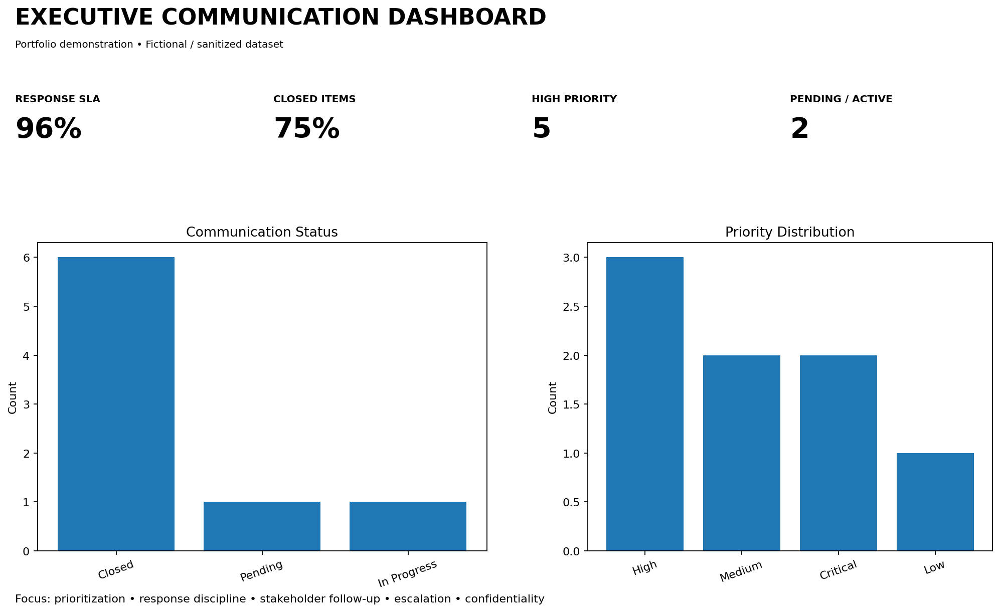

# Executive Communication Management

### Kiran Kumar Ambati

**Senior Executive Assistant | Executive Office | C-Suite Support | Executive Communication**

> A professional portfolio demonstrating structured executive communication, email prioritization, stakeholder coordination, follow-up, escalation management and executive correspondence.

---

## 🎯 Executive Communication Management

Effective executive communication requires more than responding to emails. It involves prioritizing information, identifying business-critical matters, coordinating stakeholders, maintaining response discipline and ensuring timely follow-through.

This portfolio demonstrates a structured approach to managing executive communication from initial receipt through closure.

---

## Core Responsibilities

| Area | Approach |
|---|---|
| 📧 Email Management | Review, categorize and prioritize executive correspondence |
| 🎯 Prioritization | Identify urgent, high-impact and business-critical communication |
| 👥 Stakeholder Coordination | Coordinate internal and external stakeholders |
| ⏱️ Response Management | Maintain response timelines and communication SLAs |
| ⚠️ Escalation Management | Escalate critical issues to appropriate leadership |
| 🔄 Follow-Up | Track pending responses, commitments and outstanding actions |
| 🔒 Confidentiality | Handle sensitive executive information with discretion |
| 📊 Reporting | Provide communication status and management visibility |

---

## 🔄 Executive Communication Workflow

**Receive → Review → Prioritize → Respond → Escalate → Follow Up → Close**

### 1. Receive
Capture incoming emails, requests, correspondence and executive communication.

### 2. Review
Understand the purpose, urgency, stakeholders and required action.

### 3. Prioritize
Classify communication based on business impact, urgency and executive priority.

### 4. Respond
Prepare or coordinate appropriate responses while maintaining professional communication standards.

### 5. Escalate
Identify critical issues requiring executive attention and escalate them appropriately.

### 6. Follow Up
Track pending responses, commitments and stakeholder actions.

### 7. Close
Confirm completion and maintain appropriate records for future reference.

---

## 📊 Communication Dashboard

The dashboard provides a visual portfolio demonstration of communication activity, response discipline and priority distribution.

**Portfolio demonstration:** The dashboard uses fictional / sanitized data.

### Dashboard Focus

- Response SLA
- Communication closure
- High-priority items
- Pending actions
- Communication status
- Priority distribution
- Stakeholder follow-up
- Escalation management
- Confidentiality

---

## 📁 Supporting Tracker

The `communication-tracker.csv` file demonstrates structured tracking of executive communication, priorities, status and follow-up requirements.

---

## 💼 Executive Support Value

This portfolio demonstrates the ability to:

- Support senior leadership and C-Suite executives
- Manage executive correspondence
- Prioritize business-critical communication
- Coordinate multiple stakeholders
- Maintain response discipline
- Track pending actions and commitments
- Manage escalations
- Provide management visibility through reporting
- Handle sensitive information with discretion
- Maintain structured communication records

---

## 🛠️ Tools & Working Methods

**Microsoft Outlook | Microsoft Excel | Microsoft Teams | PowerPoint | Email Management | Communication Tracking | MIS Reporting | Action Tracking | Stakeholder Coordination | Executive Follow-Up**

---

> **Note:** All portfolio datasets are fictional / sanitized and are intended only to demonstrate executive support and operational management capabilities.
